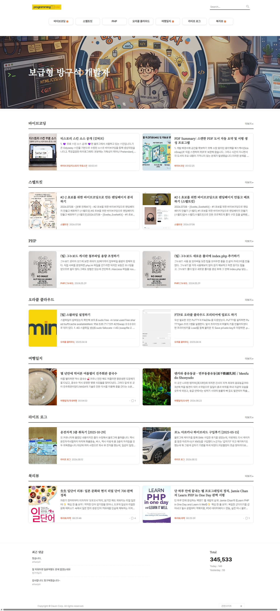

<!-- 티스토리 스킨 프로젝트 README 문서 -->

# 🎨 티스토리 반응형 블로그 스킨 (Custom Odyssey) Edition 2.

카카오 공식 **Odyssey (오디세이) 스킨**을 기반으로 가독성, 목록 레이아웃, 상단 메가메뉴, 모바일 반응성, 그리고 마크다운 다이어그램을 대폭 개선한 프리미엄 커스텀 티스토리 스킨입니다.

---

## 📸 스킨 미리보기

---

## ✨ 주요 특징 및 개선 사항

### 1. 🔤 단정하고 미려한 타이포그래피
- **본문**: 가독성이 뛰어난 산세리프 폰트 `Pretendard` 적용
- **제목/헤더**: 격조 있고 단정한 세리프 폰트 `Noto Serif KR` 적용

### 2. 🧭 상단 드롭다운 메가메뉴 (Mega Menu)
- **1차 카테고리 버튼형 UI**: 마우스 호버 시 부드러운 인터랙션 제공
- **풀와이드 드롭다운 서브메뉴**: 2차 카테고리를 한눈에 확인할 수 있는 메가메뉴
- **글 개수 & 새 글 배지**: 각 서브메뉴 옆에 **작성된 글 개수 `(숫자)`** 및 **새 글 `[N]` 배지**를 가지런히 수평 정렬
- **높이 자동 반응**: 카테고리 항목 수에 따라 드롭다운 높이가 자동으로 확장되는 스크립트 내장

### 3. 📰 신문/뉴스 포털형 최신글 5개 헤드라인 레이아웃
- **포커스 뉴스 1면 배치**: 메인 화면 상단에 5개 기사를 언론사 1면 스타일로 구성
  - **1번 Hero 기사**: 상단 대형 제목 + 좌측 큼직한 썸네일 + 우측 상세 본문 요약문
  - **2, 3번 Sub 기사**: 좌측 하단 2열에 좌측 썸네일 + 우측 제목/요약문 배치
  - **4, 5번 Side 기사**: 우측 세로 구분선 분할 영역에 상단 와이드 썸네일 + 하단 제목/서브텍스트 배치
- **홈 커버 및 자동 로딩 지원**: 티스토리 홈 커버(`news-headline`) 지원 및 커버 미설정 시에도 메인에서 최신글 5개 자동 렌더링

### 4. 📚 메인 페이지 2열 카테고리 그리드 (Book Cover 비율)
- **비동기 카테고리 로딩**: 메인 화면에서 카테고리별 최신글을 1줄에 2개씩 2열 그리드로 자동 로드
- **북커버(Book Cover) 세로 비율 썸네일**: 표준 도서 표지 비율(`1/3` 카드 너비 차지)로 책표지가 찌그러짐 없이 큼직하고 시원하게 렌더링
- **산뜻한 오렌지 포인트**: 카테고리 링크에 오렌지색(`#ff6b35`) 포인트 컬러 적용
- **규격화된 텍스트 영역**: 좌우 카드 모두 `[제목 2줄] → [본문 요약 2줄] → [하단 메타정보(카테고리/날짜/댓글)]`로 100% 대칭 정렬

### 5. 📱 모바일(스마트폰) 환경 완벽 최적화
- **1열 반응형 카드**: 767px 이하 모바일 화면에서 자연스러운 1열 카드 레이아웃 전환
- **컴팩트 북커버 썸네일**: 모바일 화면 폭에 최적화된 `95px × 125px` 크기로 본문 텍스트 공간 확보
- **햄버거 메뉴 & 드로어**: 모바일 터치 환경에 최적화된 사이드바 메뉴 열기/닫기 지원

### 6. 📊 Mermaid 다이어그램 자동 렌더링 지원
- 티스토리 마크다운 에디터 사용 시 발생하는 코드 블록 내 줄바꿈 깨짐 현상을 자동으로 감지 및 보정하는 스크립트 내장
- `mermaid` 플로우차트, 시퀀스 다이어그램 등의 매끄러운 렌더링 지원

### 7. 🏆 포스팅 본문 우측 카테고리 최신글 10개 랭킹 위젯
- **뉴스 포털 스타일 1~10 순위 리스트**: 글 본문 우측에 해당 카테고리의 최신 글 10개를 번호 순위와 함께 일목요연하게 표시
- **Sticky 스크롤 인터랙션**: PC 화면에서 본문을 스크롤할 때 우측에 계속 고정되어 머무르며 추가 탐색 유도
- **반응형 스택**: 1060px 이하 모바일 화면에서는 본문 하단으로 자연스럽게 전환

### 8. 🧩 하단 위젯 영역 탑재
- 본문 하단에 '최근 댓글' 및 '방문자수(Total / Today / Yesterday)' 통계 위젯 기본 내장

---

## 🚀 사용 및 적용 방법

> [!IMPORTANT]
> **반드시 티스토리 기본 `Odyssey (오디세이)` 스킨을 먼저 적용한 후 HTML/CSS 편집을 진행해야 기본 리소스 및 치환자가 정상 동작합니다.**

1. **티스토리 블로그 관리자 홈**에 접속합니다.
2. 좌측 메뉴에서 **꾸미기 > 스킨 변경**으로 이동합니다.
3. 티스토리 기본 제공 스킨 중 **`Odyssey (오디세이)` 스킨을 선택하고 [적용]**합니다. *(※ 필수 사전 작업)*
4. 좌측 메뉴에서 **꾸미기 > 스킨 편집**을 클릭한 후, 우측 상단의 **[html 편집]** 버튼을 클릭합니다.
5. **HTML 편집**:
   - 상단 **`HTML`** 탭을 선택합니다.
   - 본 저장소의 [`skin.html`](skin.html) 전체 코드를 복사하여 기존 코드를 모두 지우고 붙여넣습니다.
6. **CSS 편집**:
   - 상단 **`CSS`** 탭을 선택합니다.
   - 본 저장소의 [`style.css`](style.css) 전체 코드를 복사하여 기존 코드를 모두 지우고 붙여넣습니다.
7. 우측 상단의 **[적용]** 버튼을 클릭하여 저장을 완료합니다.

---

## 📁 파일 구성

| 파일명 | 설명 |
| :--- | :--- |
| [`skin.html`](skin.html) | 티스토리 블로그 스킨 HTML 템플릿 (카테고리 로더, 메가메뉴 높이 스크립트, Mermaid 보정 내장) |
| [`style.css`](style.css) | 스킨 스타일시트 (타이포그래피, 메가메뉴, 2열 북커버 그리드, 모바일 반응형) |
| [`CHANGELOG.md`](CHANGELOG.md) | 스킨 기능 수정 및 최적화 상세 변경 이력 |
| [`README.md`](README.md) | 스킨 소개 및 설치 가이드 문서 |

---

## 📄 라이선스

본 스킨은 Kakao Corp.의 Tistory Odyssey 스킨을 기반으로 커스텀 제작되었습니다.
